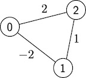

## 1. Improving Dijkstra

In our analysis of the work done by Dijkstra's algorithm, we ended up
with a bound of $O(|E|\log |E|)$. Let's take a closer look at how
changing the type of heap used affects this work bound.

a) A $d$-ary heap is a generalization of a binary heap in which we
have a $d$-ary tree as the data structure. The heap and shape
properties are still maintained, but each internal node now has $d$
children (except possibly the rightmost leaf). What is the maximum
depth of a $d$-ary heap?

**put in answers.md**

.  
.  
.  

b) In a binary heap the `delete-min` operation removes the root,
places the rightmost leaf at the root position and restores the heap
property by swapping downward. Similarly the `insert` operation places
the new element as the rightmost leaf and swaps upward to restore the
heap property. What is the work done by
`delete-min` and `insert` operations in a $d$-ary heap? Note that the
work differs for each operation. 

**put in answers.md**

.  
.  
.  

c) Now, suppose we use a $d$-ary heap for Dijkstra's algorithm. What is the
new bound on the work? Your bound will be a function of
$|V|$, $|E|$, and $d$ and will account for the `delete-min` and
`insert` operations separately.

**put in answers.md**

.  
.  
.  

d) Now that we have a characterization of how Dijkstra's algorithm
performs with a $d$-ary heap, let's look at how we might be able to
optimize the choice of $d$ under certain assumptions. Let's suppose
that we have a moderate number of edges, that is  $|E| = |V|^{1+\epsilon}$ for $0<\epsilon
< 1$. What value of $d$ yields an overall running time of $O(|E|)$?

**put in answers.md**

.  
.  
.  

## 2. All-pairs shortest paths using Dynamic Programming

In class we looked at the all-pairs shortest path (APSP) problem, and
used a graph transformation so that we could essentially run Dijkstra
with all possible starting source vertices. This resulted in an
algorithm for APSP with work $O(|V||E|\log |E|).$ Let's consider
a more direct approach using dynamic programming.

Suppose that we label the vertices from $0$ to $n-1$, and let
$\mathit{APSP}(i, j, k)$ be the weight of the shortest path between vertices $i$ and $j$
such that only vertices $0, 1, \ldots, k$ are allowed to be used. Then
the cost of the shortest path between vertices $i$ and $j$ is then
given by $\mathit{APSP}(i, j, n-1).$

a) Consider the following graph with 3 vertices.

Compute $\mathit{APSP}(i, j, k)$ for all $i, j, k$.

**put in answers.md**

.  
.  
.  

b) Do you see a relationship between $\mathit{APSP}(i, j, 1)$ and
$\mathit{APS}(i, j, 2)$? Can you write $\mathit{APS}(i, j, 2)$ in
terms of $\mathit{APS}(i, j, 0)$ and $\mathit{APS}(i, j, 1)$ only?

**put in answers.md**

.  
.  
.  

c) Suppose that an oracles makes available to us all possible values
for $\mathit{APSP}(i, j, k-1)$ for all $i, j$ and some particular value of $k-1  \le n$. Then what is the shortest path cost $\mathit{APSP}(i, j, k)$? Well, it is either $\mathit{APSP}(i,
j, k-1)$, or some other path from $i$ to $j$ that has length $k$. Generalize your observation from b) above to give an optimal substructure property for
$\mathit{APSP}(i, j, k).$

**put in answers.md**

.  
.  
.  

d) As usual naively implementing this optimal substructure
property to compute $\mathit{APSP}(i, j, n-1)$ for all $i, j$ will be
inefficient. Suppose we perform top-down memoization so that we only
ever compute each subproblem from scratch once. How many distinct
subproblems will be computed from scratch, and what is the resulting
work of this dynamic programming algorithm?

**put in answers.md**

.  
.  
.  

e) Compare the work of this algorithm against that of Johnson's
algorithm. In what cases is our dynamic programming algorithm
preferable?

**put in answers.md**

.  
.  
.  

## 3. Spanning trees

a) Consider a variation of the MST problem that instead asks for a tree that minimizes the maximum weight of any edge in the spanning tree. Let's call this the minimum maximum edge tree (MMET). Is a solution to MST guaranteed to be a solution to MMET? Why or why not?

**put in answers.md**

.  
.  
.  

b) Suppose that the optimal solution to MST is impossible to use for some reason. Describe an algorithm to instead find the next best tree (pseudo-code or English is fine). That is, return the tree with the next lowest weight. 

**put in answers.md**

.  
.  
.  

c) What is the work of your algorithm?

**put in answers.md**

.  
.  
.  

